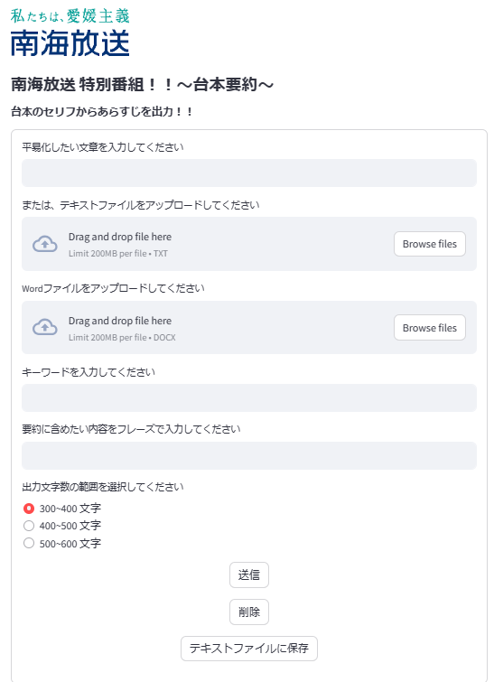

# 南海放送特別番組要約アプリケーション

南海放送 ( [https://www.rnb.co.jp/](https://www.rnb.co.jp/)https://www.rnb.co.jp/ ) の特別番組台本から、その要約文を生成するアプリケーションです。初期画面は下の画像のようになっています。
<p align="center">

</p>

# 下準備

このアプリケーションを利用を開始するにあたって必要な操作を説明します。なお、windowsのコマンドプロンプトを使って操作を行うと仮定します。

### APIキーの取得

このアプリケーションではChatGPTを利用しており、APIキーと呼ばれるものが必要になってきます。以下のサイトにAPIキーの取得方法が記載してあるので、それを参考にしてAPIキーを取得してください。

https://programming-zero.net/openai-api-key/

### インストール

```
$ git clone https://github.com/SugiyamaSeiji/PBL.git
```
アプリケーションの利用に必要なプログラムファイルを、上記のコマンドでインストールします。インストールの際にはGitHubアカウントが必要となるので、アカウントが無い場合には作成してください。

### 一部ファイルの修正

```
$ cd PBL
$ notepad functions.py
```
最初に取得したAPIキーをプログラムに書き込む必要があります。上記のコマンドを入力すると、メモ帳が開きます。メモ帳の上から１０行目の、「APIキーを入力してください」の部分を取得したAPIキーに書き換えてください。例として、APIキーが「10001」であった場合に書き換えたものを下に示します。
```
openai.api_key = "10001"
```
書き換えた後、上書き保存を行うのを忘れないようにして下さい。
以上でアプリケーションを利用するための準備は完了です。

# アプリケーションの起動

```
$ cd PBL
$ streamlit run main.py
```
ブラウザ上でアプリケーションを起動するために、コマンドプロンプトで上記のコマンドを実行します。実行後、ブラウザ上でアプリケーションが起動し、利用できるようになります。

# 基本的なアプリケーションの使い方

基本的には要約したい文章をテキストボックスに入力、またはファイルをアップロードし、送信ボタンを押すことで文章が要約されます。入力を誤った場合には削除ボタンを押すことで入力した内容・アップロードしたファイルを消すことができます。なお、送信ボタンを押してから出力結果が表示されるまでには１～２分程度かかります。

# 環境

フレームワーク	：Streamlit

使用モデル	：gpt-4-1106-preview

Openai		：openai==0.28

# 機能

### 入力
要約したい文章のの入力方法は、手入力・テキストファイル・Wordファイルの３種類あります。ただし、Wordファイルの場合は台本の形である必要があり、表の４列目がコメントや発言内容等になっているか確認してください。

### 文字数指定
３００～４００文字・４００～５００文字・５００～６００文字の３つの内から選択でき、出力文の文字数を指定することができます。しかし、出力文の文字数が指定範囲内に収まらない場合もあるため、あくまでも目安として考えてください。出力文の右下には実際の出力文の文字数が表示されるため、それを確認して指定した範囲から大きく離れている場合は実行し直すことを勧めます。

### キーワード
キーワードとして、入力した単語を出力文に組み込むことができます。キーワードは空白(スペース)を挿入することで複数入力可能です。以下に入力例を示します。
<p align="center">

</p>

### フレーズ
入力した文章またはフレーズを出力文に組み込むことができます。以下に入力例を示します。
<p align="center">

</p>

### 出力
要約文は普通の要約に加え、上述したキーワードあり・フレーズありのパターンを含めて最大３つまで出力されます。

### 履歴
要約文を表示した後、前回の実行時に出力した要約文を、入力したファイル名やキーワード・フレーズと共に表示することができます。つまり、過去１回分の履歴を表示できるということです。

### 出力を保存
文章の要約が終了した後「テキストファイルに保存」を選択すると、出力された要約文をテキストファイルに保存することができます。以下のコマンドを実行すると、保存した要約文を確認することができます。
```
$ cat history.txt
```
